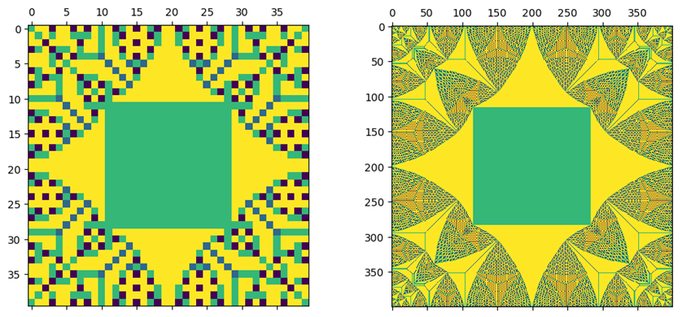
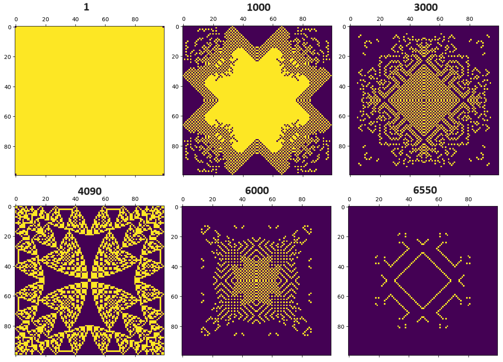

An implementation of the Bak–Tang–Wiesenfeld abelian sandpile model in Python. The Jupyter files explain the code and explore some of the dynamics of the system.

Preview of some of the results from the code:

